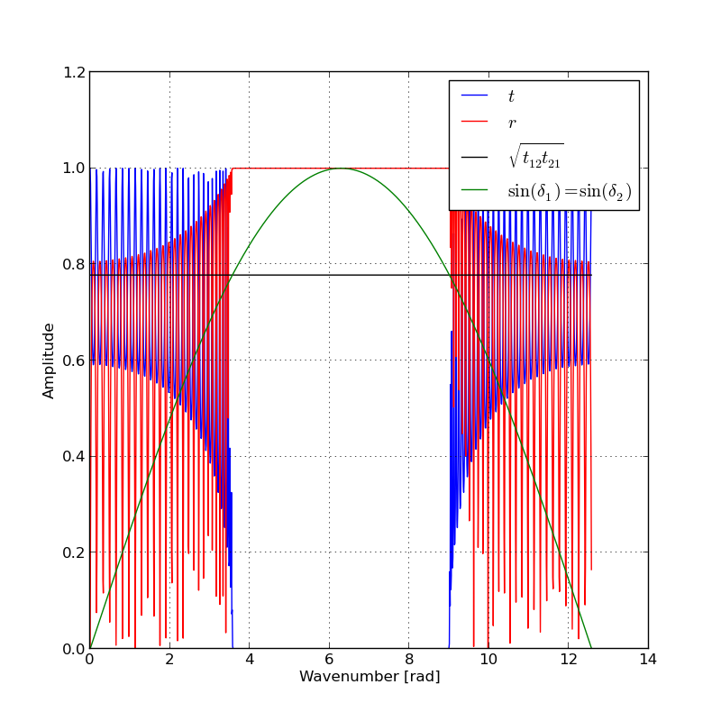
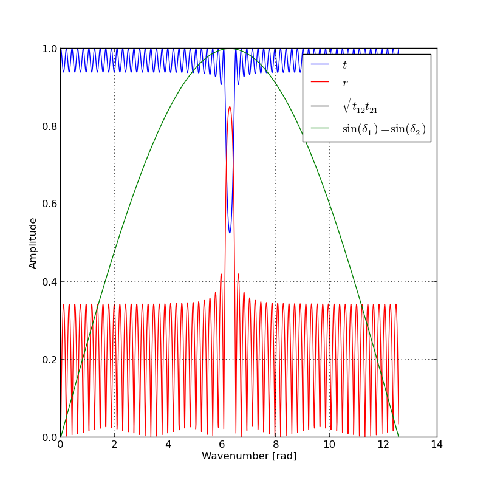
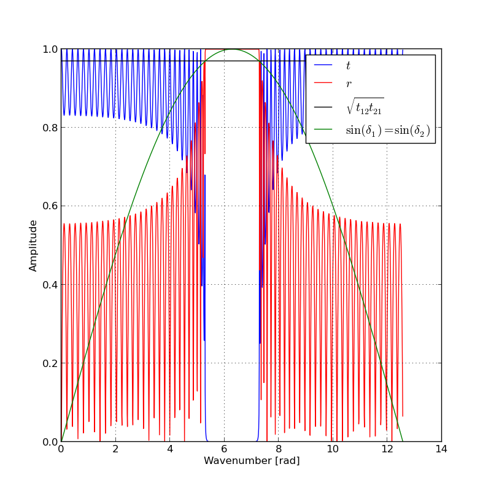
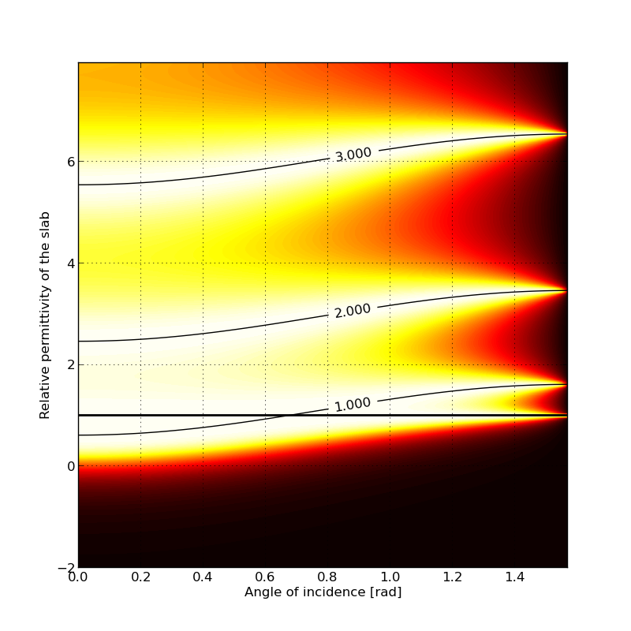
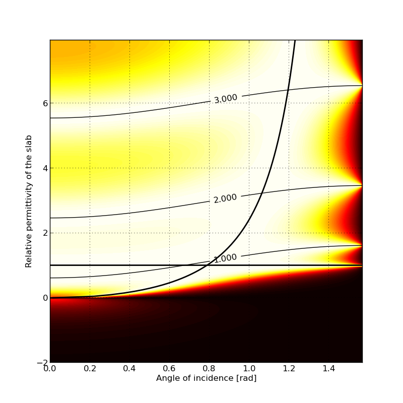
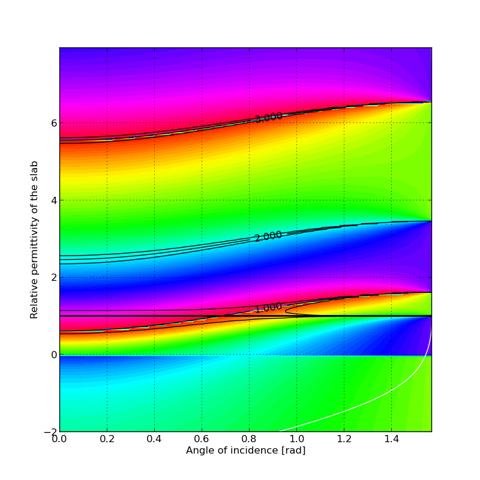
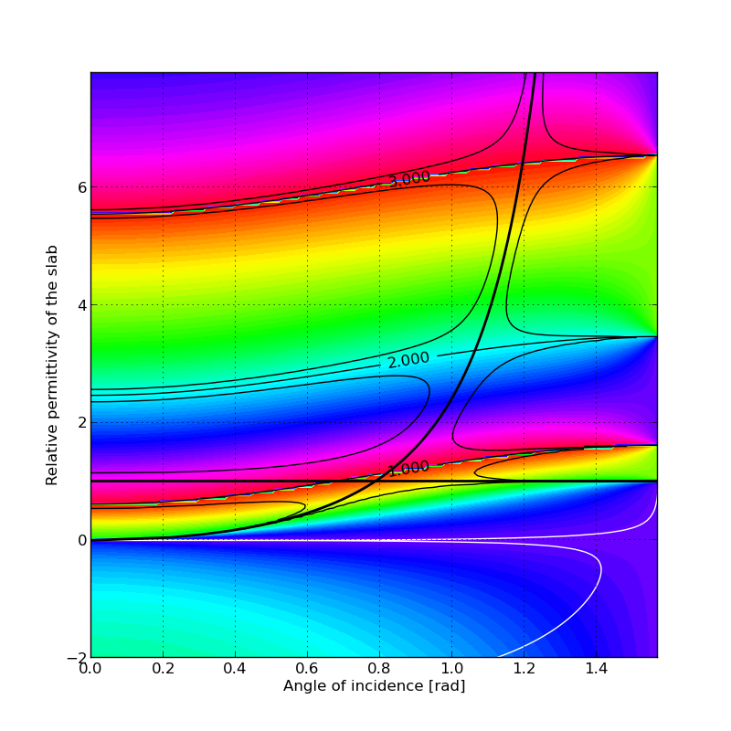

## What is the Transfer Matrix Method?
TMM computes the light propagation through a stack of flat layers of different materials, each of which is described by its thickness, index of refraction, and possibly also by the absorption coefficient. These parameters are represented by a 2x2 matrices arranged in such a way that the behaviour of the whole stack can be computed by simple matrix multiplication.

It is therefore useful for the design of dielectric mirrors, filters, anti-reflex layers, as well for analysis of experimental spectroscopic data of thin layers which are often burdened by Fabry-Pérot oscillations. It can also be modified to estimate guided modes in arbitrarily complex planar waveguides, including gain-loss and plasmonic effects.

TMM can be considered an analytic method, since the multiplication of 2x2 matrices yields a closed analytic expression for the reflectance and transmittance structure. But rather it is 'semi'-analytic, since for a higher number of layers this expression becomes complex beyond the capabilities of a human. The numerical computation is, however, usually extremely fast. 

Note that a similar numerical approach of 2x2 matrices multiplication is used also for different problems in physics - one example is the computation of paraxial optics where the matrices represent lenses, air gaps, curved mirrors and other optical elements, but this kind of computation is not covered here.

## Usage
(Should be cleaned up and clarified - Work in progress)

## Examples
#### Dielectric mirror bandwidth
A photonic band-gap forms for a periodic stack of dielectric bilayers. The central frequency is determined by the optical thickness of the bilayer. 

In contrast, its spectral width depends mostly on the reflectance from the 1-2 and 2-1 interfaces:

(Some maths will be added here - Work in progress)

#### Oblique incidence on an interface with given permittivity
Transmittance amplitude differs for TE (left) and TM polarisations (right):

There are three possible conditions for 100% transmittance of a dielectric slab (marked by black lines):
1) Fabry-Pérot resonance (numbered black lines)
2) If there is perfect wave-impedance match to the surrounding medium  (horizontal line at epsilon=1)
3) Brewster angle of incidence (thick black line, for TM polarisation only)

The corresponding phase gained through propagation also differs between TE and TM. Note that TE polarisation exhibits an abrupt change of transmittance phase at the dielectric-metallic  transition, although the amplitude remains nonzero.

#### Inspection of the field intensities inside the structure
(Work in progress)

#### Filtering of simulated and experimental thin-film spectra
(Work in progress)

## Links

Another TMM implementations here on github: https://github.com/sbyrnes321/tmm and https://github.com/kitchenknif/pytmm

What if the layers are laterally structured? Many approaches can be used, e.g. https://github.com/FilipDominec/python-meep-utils
